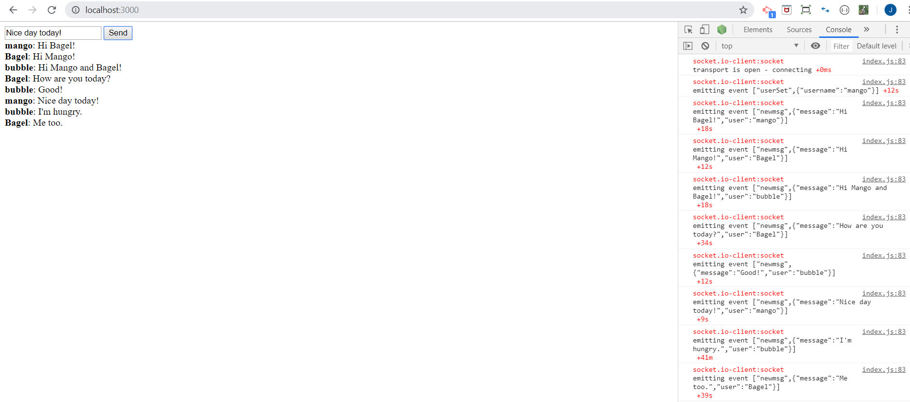
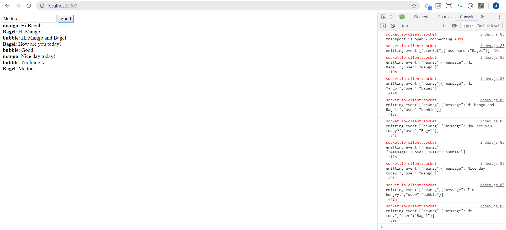
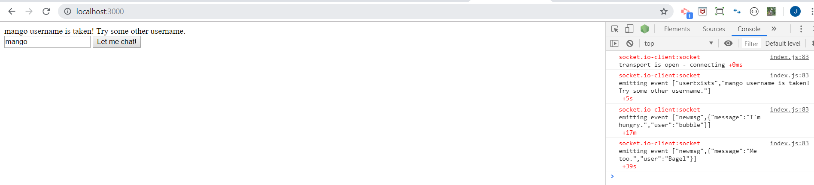

# Chat_Soket.IO
## A chat application by using Soket.IO. Ref: https://www.tutorialspoint.com/socket.io/socket.io_chat_application.htm

### User: Mango:

### User: Bagel:

### User: Bubble:

### User name is taken:

